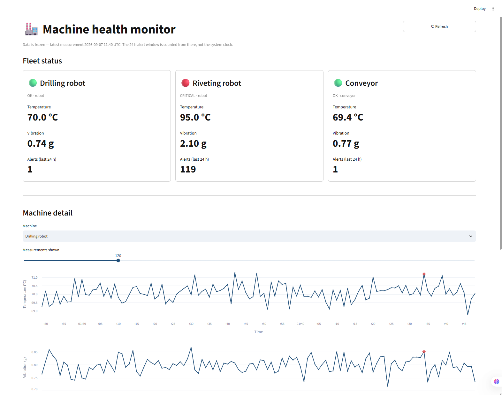
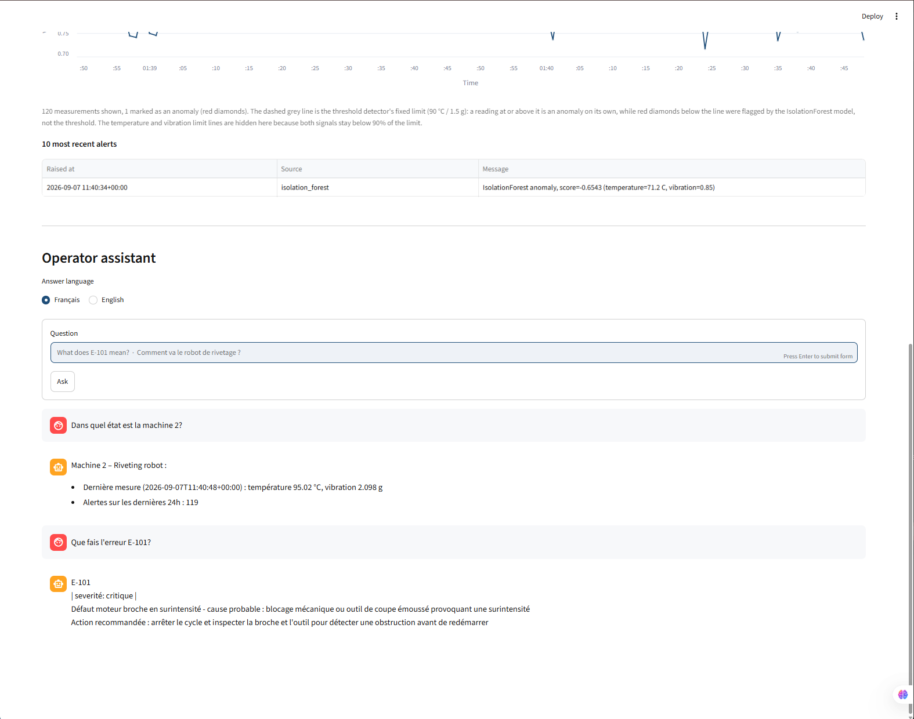
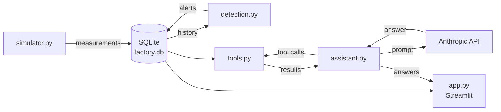

[English](#english) · [Français](#français)

# English

## machine-health-monitor

This project simulates three factory robots, detects when one starts to fail, and lets
an operator ask a plain-language assistant what is going on. Sensor data is generated
locally, scored by a fixed threshold check and a per-machine IsolationForest, and shown
on a Streamlit dashboard next to an Anthropic-powered assistant that answers only from
the live database and a list of 80 error codes.

## Screenshots



*Fleet overview — one card per machine (health light, latest temperature and vibration,
24 h alert count), then per-machine charts with anomalies marked.*



*Operator assistant (French / English) — answers a follow-up about machine 2 from the
live database, then explains error code E-101 from the reference list.*

## Architecture



`simulator.py` writes sensor readings; `detection.py` reads the history and writes back
alerts; `assistant.py` answers questions through the read-only tools in `tools.py`;
`app.py` shows both the data and the assistant. Every module goes through `db.py` — the
only place any SQL lives.

| File | Role |
|------|------|
| `simulator.py` | Generates a temperature and vibration reading per machine per simulated second; machine 2 slowly drifts toward failure. |
| `db.py` | SQLite access layer for the `machines`, `measurements` and `alerts` tables. The only module that issues SQL. |
| `detection.py` | Fixed threshold checks plus a per-machine IsolationForest; writes one alert per flagged reading. |
| `tools.py` | Read-only database functions exposed to the assistant, with their Anthropic tool schemas. |
| `assistant.py` | Operator assistant: runs the Anthropic tool-calling loop, answers in French or English. |
| `app.py` | Streamlit dashboard: fleet health cards, per-machine charts, embedded assistant. |
| `data/error_codes.csv` | 80 reference error codes: label, probable cause, operator action, severity. |
| `.env.example` | Template for the local `.env` (`LLM_PROVIDER`, `ANTHROPIC_API_KEY`, `MODEL_ANTHROPIC`). |
| `pyproject.toml` | Dependencies and metadata, managed with uv. |
| `.streamlit/config.toml` | Light, high-contrast theme for the dashboard. |

## Quickstart

Requires Python 3.11+ and [uv](https://docs.astral.sh/uv/).

```bash
git clone https://github.com/DavidLengelle/machine-health-monitor.git
cd machine-health-monitor
uv sync

cp .env.example .env
# edit .env and set ANTHROPIC_API_KEY (format sk-ant-...)

uv run python simulator.py --duration 3600 --speed 200 --seed 42
uv run python detection.py --machine all --method both --train
uv run streamlit run app.py
```

The dashboard opens at `http://localhost:8501`. The simulator run is deterministic with
`--seed 42`. Without `ANTHROPIC_API_KEY` the whole dashboard still works; only the
assistant is disabled.

## Design decisions

**IsolationForest over Local Outlier Factor**

The failure modelled here is a slow global drift of a machine's whole operating point,
not a local density anomaly, which fits IsolationForest's isolation-by-partitioning
approach. It scores unseen readings directly, so detection can judge data recorded
after training, and a fitted forest is a small object to persist per machine with
joblib. Local Outlier Factor targets outliers inside one fixed dataset and is the
weaker fit for all three points.

**Threshold detector kept next to the model**

A fixed temperature / vibration limit runs in parallel with the model. It is trivial to
explain to an operator ("95 °C is over the 90 °C limit") and gives a baseline to judge
the model against. The two overlap only in part: the IsolationForest flags machine 2's
drift well before the 90 °C threshold is ever reached.

**Training on the first third of each machine's history**

Each model is fitted on the earliest 30% of a machine's readings, assumed healthy, then
only scores readings after that window. The simulator starts every machine healthy and
only machine 2 drifts later, so the opening slice is a safe baseline with no labelling.

**Full context in the prompt, not RAG**

All 80 error codes go straight into the system prompt. They are short, they fit
comfortably, and they are cached. A retrieval step would add an index, an embedding
model and another failure mode for no gain at this size.

**Three-block system prompt, cache breakpoint on block 2**

Block 1 (instructions) and block 2 (the code list) are byte-identical for French and
English and carry the `cache_control` breakpoint; block 3 is the small per-language
directive. One cache entry then serves both languages, and only block 3 is re-sent per
call.

**Fixed read-only tools, not free SQL**

The assistant has four named functions — `list_machines`, `get_machine_status`,
`get_recent_alerts`, `get_measurement_stats` — each with a typed schema. The model
cannot read or write anything outside those shapes, results are predictable, and no
write path is ever exposed. A generic `run_sql` tool would give up all three.

**24 h window anchored on the latest measurement**

The "last 24 h" is counted back from the most recent row in the database, not the
system clock. The demo data set is generated once and then frozen, so a system-clock
window would drop every row and show "CRITICAL" next to "0 alerts". The dashboard and
the assistant use the same anchor so they cannot disagree.

**Swappable LLM layer via `LLM_PROVIDER`**

The provider is chosen by an environment variable: `anthropic` is implemented, `ollama`
is stubbed. A site that cannot let sensor data leave its network can point the same
assistant at a local model without changing the calling code.

## Limitations

- The sensor data is simulated, not measured.
- Only one failure mode is modelled — machine 2's drift; the other two machines are stationary noise.
- No remaining-useful-life estimate: the system reports "abnormal now", not "fails in N hours".
- The dashboard is built for a maintenance overview, not for an operator reacting at the machine in real time.
- Alerts are matched to measurements by exact timestamp, not by a measurement id. This works only because `detection.py` copies the timestamp through; a production system would use a foreign key.
- The IsolationForest produces about 1% false positives by construction (`CONTAMINATION=0.01`). The dashboard absorbs these by showing the amber light only from 5 alerts in the window upward.

Built with the help of Claude Code, Anthropic's agentic CLI.

---

# Français

## machine-health-monitor

Ce projet simule trois robots d'usine, détecte quand l'un d'eux commence à tomber en
panne, et permet à un opérateur de demander en langage courant à un assistant ce qui se
passe. Les données capteurs sont générées localement, évaluées par un contrôle de seuil
fixe et par un IsolationForest entraîné par machine, puis affichées sur un tableau de
bord Streamlit à côté d'un assistant propulsé par l'API Anthropic qui répond uniquement
à partir des données en base et d'une liste de 80 codes d'erreur.

## Captures d'écran


*Vue d'ensemble — une carte par machine (voyant de santé, dernières température et
vibration, nombre d'alertes sur 24 h), puis les courbes par machine avec les anomalies
marquées.*


*Assistant opérateur (français / anglais) — répond à une question de suivi sur la
machine 2 à partir des données en base, puis explique le code d'erreur E-101 de la liste
de référence.*

## Architecture


`simulator.py` écrit les relevés capteurs ; `detection.py` lit l'historique et réécrit
des alertes ; `assistant.py` répond aux questions via les outils en lecture seule de
`tools.py` ; `app.py` affiche les données et l'assistant. Chaque module passe par
`db.py` — le seul endroit où vit du SQL.

| Fichier | Rôle |
|---------|------|
| `simulator.py` | Génère un relevé de température et de vibration par machine et par seconde simulée ; la machine 2 dérive lentement vers la panne. |
| `db.py` | Couche d'accès SQLite pour les tables `machines`, `measurements` et `alerts`. Le seul module qui émet du SQL. |
| `detection.py` | Contrôles de seuil fixe et un IsolationForest par machine ; écrit une alerte par relevé signalé. |
| `tools.py` | Fonctions de base en lecture seule exposées à l'assistant, avec leurs schémas d'outils Anthropic. |
| `assistant.py` | Assistant opérateur : exécute la boucle de tool calling Anthropic, répond en français ou en anglais. |
| `app.py` | Tableau de bord Streamlit : cartes de santé de la flotte, courbes par machine, assistant intégré. |
| `data/error_codes.csv` | 80 codes d'erreur de référence : libellé, cause probable, action opérateur, sévérité. |
| `.env.example` | Modèle du fichier `.env` local (`LLM_PROVIDER`, `ANTHROPIC_API_KEY`, `MODEL_ANTHROPIC`). |
| `pyproject.toml` | Dépendances et métadonnées, gérées avec uv. |
| `.streamlit/config.toml` | Thème clair et très contrasté pour le tableau de bord. |

## Démarrage rapide

Nécessite Python 3.11+ et [uv](https://docs.astral.sh/uv/).

```bash
git clone https://github.com/DavidLengelle/machine-health-monitor.git
cd machine-health-monitor
uv sync

cp .env.example .env
# edit .env and set ANTHROPIC_API_KEY (format sk-ant-...)

uv run python simulator.py --duration 3600 --speed 200 --seed 42
uv run python detection.py --machine all --method both --train
uv run streamlit run app.py
```

Le tableau de bord s'ouvre sur `http://localhost:8501`. Le run du simulateur est
déterministe avec `--seed 42`. Sans `ANTHROPIC_API_KEY`, tout le tableau de bord
fonctionne quand même ; seul l'assistant est désactivé.

## Décisions de conception

**IsolationForest plutôt que Local Outlier Factor**

La panne modélisée ici est une dérive globale et lente de tout le point de
fonctionnement d'une machine, pas une anomalie de densité locale, ce qui convient à
l'approche d'isolement par partitionnement d'IsolationForest. Le modèle évalue
directement des relevés jamais vus, donc la détection peut juger des données
enregistrées après l'entraînement, et une forêt entraînée est un objet léger à
sauvegarder par machine avec joblib. Local Outlier Factor cible les valeurs aberrantes
au sein d'un jeu de données figé et convient moins bien sur les trois points.

**Détection à seuil conservée à côté du modèle**

Une limite fixe de température et de vibration tourne en parallèle du modèle. Elle
s'explique immédiatement à un opérateur (« 95 °C dépasse la limite de 90 °C ») et donne
une référence pour juger le modèle. Les deux ne se recoupent qu'en partie :
l'IsolationForest signale la dérive de la machine 2 bien avant que le seuil de 90 °C ne
soit atteint.

**Entraînement sur le premier tiers de l'historique de chaque machine**

Chaque modèle est entraîné sur les 30 % de relevés les plus anciens, considérés comme
sains, puis n'évalue que les relevés postérieurs à cette fenêtre. Le simulateur démarre
chaque machine en bon état et seule la machine 2 dérive plus tard, donc la tranche
initiale est une référence sûre, sans étiquetage.

**Contexte complet dans le prompt, pas de RAG**

Les 80 codes d'erreur vont directement dans le prompt système. Ils sont courts, ils
tiennent sans problème, et ils sont mis en cache. Une étape de récupération ajouterait
un index, un modèle d'embedding et un mode de défaillance de plus, sans gain à cette
échelle.

**Prompt système en trois blocs, point de cache sur le bloc 2**

Le bloc 1 (instructions) et le bloc 2 (la liste des codes) sont identiques au caractère
près en français et en anglais et portent le point de rupture `cache_control` ; le bloc
3 est la petite directive propre à la langue. Une seule entrée de cache sert alors les
deux langues, et seul le bloc 3 est renvoyé à chaque appel.

**Outils fixes en lecture seule, pas de SQL libre**

L'assistant dispose de quatre fonctions nommées — `list_machines`, `get_machine_status`,
`get_recent_alerts`, `get_measurement_stats` — chacune avec un schéma typé. Le modèle ne
peut rien lire ni écrire en dehors de ces formes, les résultats sont prévisibles, et
aucun chemin d'écriture n'est jamais exposé. Un outil `run_sql` générique renoncerait
aux trois.

**Fenêtre de 24 h ancrée sur la dernière mesure**

Les « dernières 24 h » sont comptées à rebours depuis la ligne la plus récente de la
base, pas depuis l'horloge système. Le jeu de données de démonstration est généré une
fois puis figé, donc une fenêtre calée sur l'horloge système écarterait toutes les
lignes et afficherait « CRITICAL » à côté de « 0 alerte ». Le tableau de bord et
l'assistant utilisent le même ancrage et ne peuvent donc pas se contredire.

**Couche LLM interchangeable via `LLM_PROVIDER`**

Le fournisseur est choisi par une variable d'environnement : `anthropic` est implémenté,
`ollama` est une ébauche. Un site qui ne peut pas laisser les données capteurs sortir de
son réseau peut pointer le même assistant vers un modèle local sans toucher au code
appelant.

## Limites

- Les données capteurs sont simulées, pas mesurées.
- Un seul mode de défaillance est modélisé — la dérive de la machine 2 ; les deux autres machines sont un bruit stationnaire.
- Pas d'estimation de durée de vie restante : le système signale « anormal maintenant », pas « panne dans N heures ».
- Le tableau de bord est conçu pour une vue de maintenance, pas pour un opérateur qui réagit à la machine en temps réel.
- Les alertes sont appariées aux mesures par horodatage exact, pas par identifiant de mesure. Cela ne fonctionne que parce que `detection.py` recopie l'horodatage ; un système de production utiliserait une clé étrangère.
- L'IsolationForest produit environ 1 % de faux positifs par construction (`CONTAMINATION=0.01`). Le tableau de bord les absorbe en n'affichant le voyant orange qu'à partir de 5 alertes dans la fenêtre.

Développé avec l'aide de Claude Code, l'outil en ligne de commande agentique d'Anthropic.
